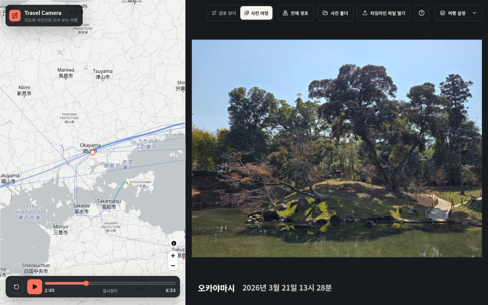
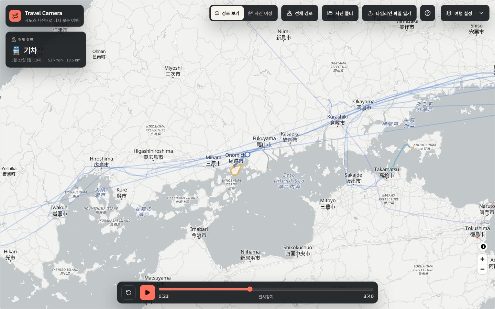
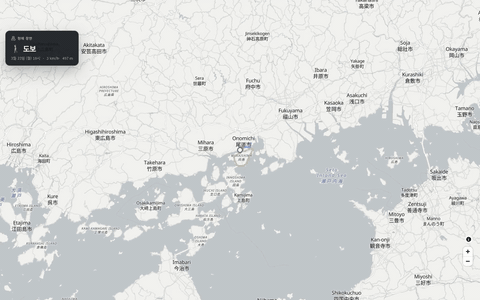
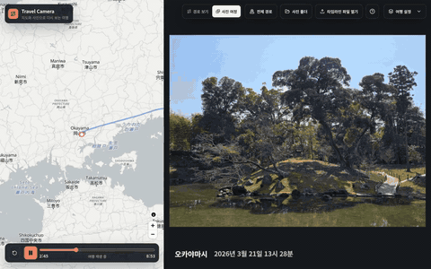
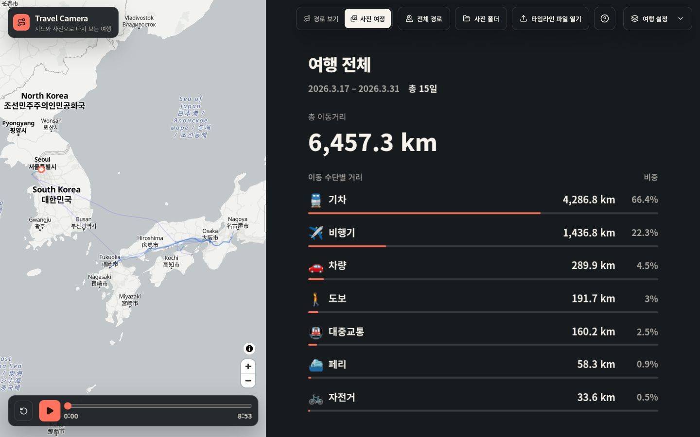
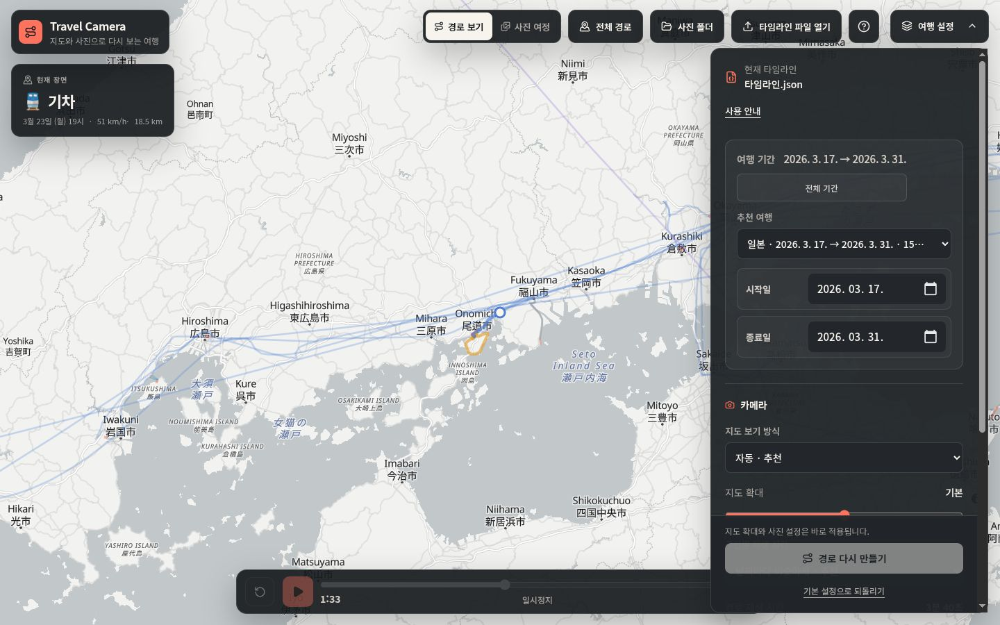

# Travel Camera

**지도와 사진으로 다시 보는 여행.**

Google 지도 타임라인과 PC에 있는 사진·영상을 연결해 여행을 다시 감상하는 로컬 웹앱입니다.
다녀온 길을 따라가고, 촬영한 순간에서 잠시 머물고, 여행 전체를 한눈에 돌아보세요.



[빠른 시작](#빠른-시작) · [데모 영상](#짧은-데모) · [사용 안내](docs/USAGE.md) · [개발 안내](docs/DEVELOPMENT.md)

## 두 가지 방식으로 감상하세요

### 경로 보기

전체 화면 지도에서 이동 경로를 따라갑니다. 이동수단 이모지와 함께 날짜·시각, 속도, 해당 이동 구간의 거리를 확인할 수 있습니다. 지나온 경로의 꼬리는 연하게 표시해 현재 위치가 더 잘 보입니다.



### 사진 여정

지도 옆에 사진과 영상을 촬영 순서대로 보여줍니다. 대표 사진만 골라 보거나 모든 사진을 감상하고, 사진마다 머무르는 시간도 조절할 수 있습니다. 두 모드는 각각 보던 위치를 기억합니다.

PC에서는 좌우로, 좁은 화면에서는 위아래로 배치됩니다. 분할선을 움직이면 지도와 사진의 크기를 바꿀 수 있습니다.

## 짧은 데모

현재 PC에서 실제 일본 여행 기록과 사진으로 촬영한 영상입니다. 각각 약 18초이며 소리는 없습니다.

| 경로 보기 | 사진 여정 |
| --- | --- |
| [](docs/assets/demos/route-view.mp4) | [](docs/assets/demos/photo-journey.mp4) |
| [경로 보기 영상 열기](docs/assets/demos/route-view.mp4) | [사진 여정 영상 열기](docs/assets/demos/photo-journey.mp4) |

GIF는 각 영상의 6초 미리보기입니다. 정지 화면은 위의 소개 이미지에서, 18초 전체 영상은 각 링크에서 볼 수 있습니다. [촬영 자료 안내](docs/MEDIA.md)

## 여행을 한눈에

여정을 불러왔을 때, **처음부터 보기**를 눌렀을 때, 마지막 **여행 전체** 화면에서 같은 요약을 보여줍니다.
여행 기간과 총 일수, 전체 이동거리, 이동수단별 거리와 비중을 차례대로 확인하세요.



## 내 여행에 맞게 조절하세요

**여행 설정**에서 추천 여행이나 날짜를 선택하고, 지도 확대·따라가기·재생 시간·사진과 영상 표시 방식을 조절합니다.
설정 이름을 가리키거나 누르면 설명을 볼 수 있습니다. **사진 목록**에서는 촬영 정보를 확인하고 이번 감상에서 제외할 사진을 고를 수 있습니다.



## 빠른 시작

Node.js **24 이상**과 Git이 필요합니다.

```sh
git clone https://github.com/sditr0414/Travel-Visualizer.git Travel-Visualizer
cd Travel-Visualizer
npm ci
npm start
```

브라우저에서 [Travel Camera 열기](http://127.0.0.1:5517)를 누르세요. 처음 실행하거나 앱이 바뀌면 화면을 자동으로 빌드합니다.

1. Google 지도에서 내보낸 **타임라인 JSON**을 엽니다. `semanticSegments` 형식을 지원하며 직접 선택하는 파일은 250MB 이하입니다.
2. 추천 여행을 선택하거나 **여행 설정**에서 날짜를 지정합니다.
3. **사진 폴더**를 연결하고 **재생**을 누릅니다. 타임라인만으로도 경로 보기를 사용할 수 있습니다.

Windows에서는 설치 후 [TravelCamera.cmd](TravelCamera.cmd)를 더블클릭할 수 있습니다. 바탕 화면 바로가기는 [설치 스크립트](scripts/Install-TravelCamera-Shortcut.cmd)를 한 번 실행해 만듭니다. 런처는 조건에 맞는 경우 `main`을 업데이트하고 브라우저를 엽니다. [실행 옵션과 자동 연결](docs/USAGE.md#실행과-종료)

## 내 파일은 내 PC에

타임라인과 사진·영상 원본은 외부로 업로드하지 않습니다. 온라인 지도는 외부 지도 서버에 접속합니다.
**정확한 장소 온라인 확인**은 기본으로 꺼져 있으며, 직접 설정하고 켠 경우에만 신뢰 가능한 사진 좌표를 지정한 장소 서비스에 보냅니다.

[파일 위치·개인정보·지원 형식](docs/PRIVACY.md)에서 저장되는 정보와 네트워크 사용 범위를 확인할 수 있습니다.

## 더 알아보기

- [사용 안내](docs/USAGE.md): 설치, 파일 연결, 감상 설정, 단축키, 문제 해결
- [설치형 지도](maps/README.md): PMTiles 준비와 오프라인 사용 범위
- [개발 안내](docs/DEVELOPMENT.md): 폴더 구조, 실행 명령, 테스트
- [문서 전체](docs/README.md): 구현 계약과 이전 버전 기록

`main`은 최신 버전입니다. UI 개선 전 버전은 [`v3` 브랜치](https://github.com/sditr0414/Travel-Visualizer/tree/v3)에 보존합니다.
